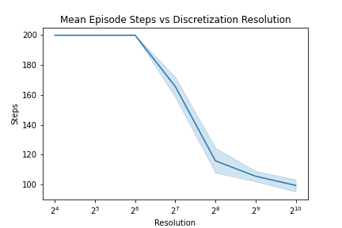
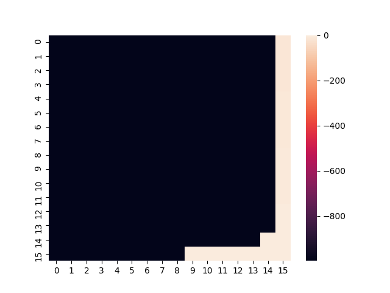
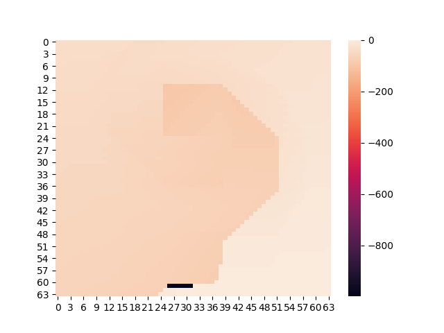
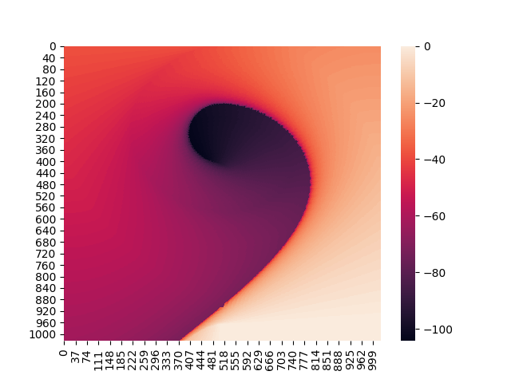

# Just-in-time (JIT) improvement on discretization planning

Can you come up with a process (algorithm) that successively refines a continuous space MDP solution? You should be able to interrupt the process at any time and return a reasonable policy; the more computation it is allowed, however, the better the resulting policy. For example, you could start by using a coarse grid to compute a no-lookahead, 1-nearest-neighbor policy. Then, given more time, you can add gridpoints to refine the resolution. Can you add on to past computations to improve on the policy?

What about if you’d like to use more nearest neighbors? Or take additional lookahead steps? Can you algorithmically determine “the best” next refinement to take given the current policy / value function and saved computation?

---
This repo applies this discretization procedure to the MountainCar problem from Sutton & Barto.

Currently, this repo only considers an iterative increase in discretization resolution, but it would be trivial to implement a schedule for knn and lookahead improvement (these parameters are implemented in the code, but a scheduling mechanism has not been implemented).

## Episode Length Decays as Resolution Increases

## Value Function Visualizations
- x-axis: discretized position of the car
  - left to right on plot -> left to right position in env
- y-axis: discretized velocity of the car
  - top to bottom on plot -> negative to positive velocity in env
- colorbar: calculated value of discretized state

### Resolution 16

### Resolution 64

### Resolution 256

### Resolution 1024
